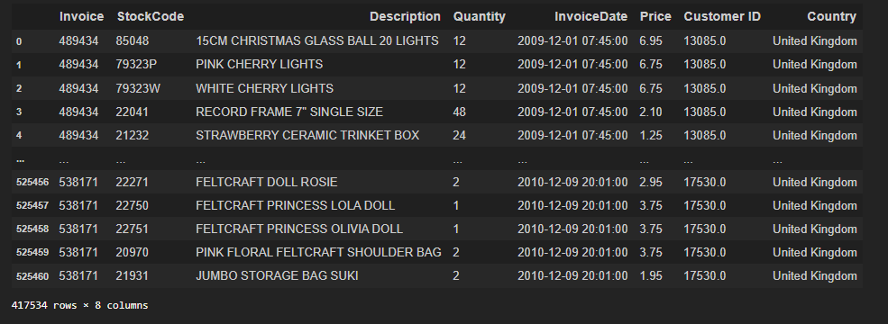
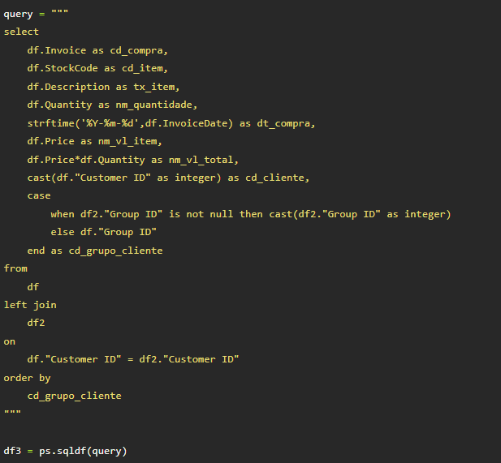

# Market Basket Analysis

Este repositório é parte da disciplina de Projeto Integrador III, do curso de engenharia eletrônica do Instituto Federal de Santa Catarina

## Conceituação

Uma das maiores necessidades de uma empresa é certamente a necessidade de estar sempre desenvolvendo novas maneiras de aumentar o volume de vendas de seus produtos. Uma das maneiras de atingir esse objetivo é vender mais para aqueles que já são clientes do negócio. Tendo isso em vista, surgiu a demanda de encontrar uma maneira de sugerir itens que podem vir a interessar e/ou complementar aqueles que os clientes já adquirem. Nesse objetivo surgiu a análise do carrinho de compras.

Utilizando de um conjunto de dados que representam as transações dos consumidores do negócio, é possível estabelecermos regras associativas do tipo X => Y, onde X representa um ou mais itens que o cliente adquiriu e Y um conjunto de itens sugeridos com base naqueles já adquiridos pelos clientes. Essas regras que embasarão as sugestões para os clientes, contudo antes de se estabelecer elas faz-se uma análise da base de dados com o fim de se estabelecer embasamento o suficiente para que a regra seja provada como efetiva.

Nessa análise da base de dados, as regras estabelecidas são mensuradas em sua maioria por 3 principais métricas.

* **Suporte**: Métrica que representa a frequência de ocorrência de compra do conjunto de itens em questão do total de compras. Sendo representada como:
  
  
  


  

* **Confiança:** Representa a probabilidade de que a transação do do lado esquerdo da regra (antecedente) também contenha o conjunto do lado direito (consequente), sendo dada por:


* **Lift:** A probabilidade de uma regra ocorrer de maneira idependente da sugestão dos itens. Há 3 posibilidades:

  * Lift > 1: O lado esquerdo da regra eleva a possibilidade dos itens do lado direito serem comprados.
  * Lift = 1: A aquisição dos itens antecendetes não influenciam na aquisição dos consequentes
  * Lift < 1: O antecedente prejudica a aquisição dos itens consequentes.


  


## Base de dados utilizada

Para simular a uma base de compras, foi utilizada uma base que está disponível na internet, no repositório de bases para machine learning do UCI, disponível neste [link](https://archive.ics.uci.edu/ml/datasets/Online+Retail+II). A base representa as  compras feitas em uma loja virtual no período de 2 anos (01/01/2009 - 09/12/2011) e contém os campos InvoiceNo (Número da nota), StockCode (código do item), Description (Descrição do item), Quantity (Quantidade comprada do item), InvoiceDate (Data da compra), UnitPrice (Preço da compra), CustomerID (Código do cliente) e Country (País do cliente). Contudo, esta tabela não resumia bem a situação estudada na empresa, então foi necessário realizar o tratamento da mesma. Para isso, foi utilizada uma lista dos nomes e gêneros, também disponível publicamente no site da [UCI](https://archive.ics.uci.edu/ml/datasets/Gender+by+Name), para atribuir nomes e gêneros aos clientes.

### Análise e tratamento da base

O primeiro procedimento realizado foi visualizar a base e contar oo número de países nas mesmas. Após observar a base, tomou-se a decisão de separar a base em grupos de clientes, utilizando os países, porém como os dados foram colhidos de uma loja inglesa, aproximadamente 90% dos dados tinham como país de origem o reino unido, assim, fez-se uma separação dos consumidores do reino unido em vários grupos. As imagens abaixo mostram a base original e contagem de linhas separadas por país.


|  |
| :---------------------------------: |
|        **Dataset original**         |

|     |
| :--------------------------: |
| **Itens comprados por país** |

Para criar os grupos dos clientes ingleses, foi selecionado cada cliente distinto e separados em blocos de tamanhos  distintos, dando números a esses grupos. Com isso, havia um dataframe com grupos de clientes originais e um datagrame que continha os clientes ingleses e seus novos grupos. Para unir esses dataframes e utilizar os novos grupos foi feita uma query utilizando o sqlite, conforme a imagem abaixo.

|  |
| :-----------------------------: |
|  Query para grupos de clientes  |

Além disso, para melhor adequação do dataset com o original, foi atribuído a cada grupo de clientes uma cidade da inglaterra, assim, utilizou-se um dataset que continha as cidades mais populosas deste país e foi atribuído aos grupos as 47 mais populosas. Com isso foi criado um dataframe com as informações de ID do grupo, código do grupo, país e região que o grupo pertence. 

|    |
| :----------------------------: |
| **Dataset grupos de clientes** |

Também se criou um dataframe contendo o código, ID e descrição dos itens e armazenados em um outro dataframe. O mesmo procedimento foi feito para o dataframe com nomes, gênero código e ID dos clientes

|  |  |
| :-------------------------: | :---------------------------: |
|     **Dataframe itens**     |    **Dataframe clientes**     |

Além disso, para manter as tabelas normalizadas, os dataframes foram salvos em datasets separados e o dataframe original foi modificado para se adequar a essas características, tendo as informações que se encontram em outras tabelas substituídas pelo ID da informação, resultando no dataframe abaixo.


## Algoritmos testados

### Algoritmo de apriori


Algoritmo proposto por Agrawal e Srikant em 1994, desenvolvido para a mineiração de dados online que contenham transações. O algortimo começa analizando os itens individualmente e expandindo um item por vez dos conjuntos que tiverem suporte maior que o dado como mínimo. Sendo assim, a ideia do algortimo se baseia no fato de que se um conjunto não é frequente, todas as regras que derivam deste conjunto também não o serão. O pseudocódigo está apresentado abaixo:

```
Apriori(T, ε)
    L1 ← {large 1 - itemsets}
    k ← 2
    while Lk−1 is not empty
        Ck ← Apriori_gen(Lk−1, k)
        for transactions t in T
            Dt ← {c in Ck : c ⊆ t}
            for candidates c in Dt
                count[c] ← count[c] + 1

        Lk ← {c in Ck : count[c] ≥ ε}
        k ← k + 1

    return Union(Lk)
    
Apriori_gen(L, k)
     result ← list()
     for all p ⊆ L, q ⊆ L where p1 = q1, p2 = q2, ..., pk-2 = qk-2 and pk-1 < qk-1
         c = p ∪ {qk-1}
         if u ⊆ c for all u in L
             result.add(c)
      return result
```

### FP-Growth


O algoritmo de FP-Growth é uma forma de aprimorar o algoritmo de apriori. O algoritmo lê a base de transações e faz a contagem da frequência em que os itens aparecem, aqueles itens que estão abaixo do suporte mínimo são retirados dos conjuntos e estessão reordenados por frequência. Com esse passo feito, cada linha do algoritmo é varrida e sendo representada na árvore, tendo o número de vezes que cada subconjunto aparece. Assim que a árvore está formada, o algortimo faz a montagem dos conjuntos de itens frequentes com base no número de aparições do item nos subconjuntos. Devido a isso, o algortimo se mostra mais rápido e menos oneroso ao sistema.


## Apache Spark

Um framework de código aberto multi-plataforma voltado para processamento de dados em larga escala por meio de clusterização e paralelismo. Pode funcionar tanto localmente quanto em uma malha de computadores e suporta programação nas linguagens Scala, Java, Python e R. 

* Arquitetura do Spark é subdividida em:

  * **Driver**: Máquina na qual aplicação é executada. Responsável por:
    - Manter informações sobre a aplicação
    - Apresentar respostas ao usuário
    - Gerenciar a distribuição de tarefas pelos executores 

  * **Jobs:** Ações paralelizadas que são separadas em uma série de passos ordenados que são chamados de Stages

  * **Executores**: Armazenam uma partição Spark para ser processada, sendo responsáveis por:
    - Executar o código designado pelo driver
    - Reportar o status da computação para o driver

  * **Slots:** Partes do executor que são responsáveis por realizar as Tasks

  * **Task:** São responsáveis pelo processamento de dados nas partições

  * **SparkSession:** Acesso ao SparkContext

  * **SparkContext:** Conexão com o Cluster

* As modificações nos dados dos dataframes só ocorrem quando uma ação é executada. Esse comportamento recebe o nome de **Lazy evaluation**
* Estruturas de dados:
  * **RDD** (Resilient distributed datasets):
    - Estrutura de baixo nível
    - Imutável
    - Complexo
    - Otimização dificultosa
  * **DataFrame**:
    - Estrutura de dados de mais alto nível
    - Imutável
    - Schema conhecido
    - Mais otimizado pelo Spark

### Configurando o ambiente Spark

* **Java JDK:** Para a instalação utilizou-se o JRE 1.8.0-301
  - Necessário criar a variável de ambiente JAVA_HOME com o diretório de instalação do JRE
  - Adicionar na variável de ambiente Path: %JAVA_HOME%\bin
* **Hadoop:** Foi feita a utilização da versão 2.7.4
  - Para a utilização é necessário realizar o download dos arquivos winutils.exe e hadoop.dll, disponíveis [aqui](https://github.com/cdarlint/winutils) e inseri-los na pasta bin do local de instalação do hadoop
  - A extração dos arquivos do .tar.gz devem ser feitas utilizando o 7-zip como administrador, para que sejam feitos os links simbólicos das bibliotecas nativas. 
  - No windows, recomenda-se a criação do diretório do Hadoop em uma pasta raiz (Ex: C:\hdp) devido à estrutura de arquivos do hadoop ter muitas pastas e o caminhodelas exceder o número máximo de caracteres do SO.
  - Necessário criar a variável de ambiente HADOOP_HOME com o diretório de instalação do HADOOP
  - Adicionar na variável de ambiente Path: %HADOOP_HOME%\bin
* **Spark:** Versão 3.12 com hadoop 2.7
  - Necessário criar a variável de ambiente SPARK_HOME com o diretório de instalação do SPARK
  - Adicionar na variável de ambiente Path: %SPARK_HOME%\bin
* **Pyspark:** Para a instalação foi utilizado a versão 3.1.2 do anaconda
  - Para a correta instalação e utilização com o jupyter notebook, é necessário criar as variáveis de ambiente:
    - PYSPARK_DRIVER_PYTHON = "jupyter"
    - PYSPARK_DRIVER_PYTHON_OPTS = "notebook"
    - PYSPARK_HADOOP_VERSION: Esta variável pode ter valor 2.7, 3.2 ou "without" dependendo da versão do hadoop que se deseja utilizar. Para a utilização foi utilizada a versão 2.7
    - PYTHONPATH: %SPARK_HOME%/python;$SPARK_HOME/python/lib/py4j-0.10.9-src.zip
  - Instalar o módulo findspark com o pip

### Utilizando o pyspark

* Inicializando uma SparkSession utilizando python

```
import findspark
from pyspark.sql import SparkSession
## Spark Conf
findspark.init()
spark = SparkSession.builder.master("local[*]").getOrCreate()
spark = SparkSession.builder.appName("marketBasket").getOrCreate()
spark.conf.set("spark.sql.execution.arrow.pyspark.enabled", "true")
spark
```

* Será exibida a mensagem abaixo, ao clicar e, "Spark UI" será aberta uma guia com informações sobre a seção do spark sendo utilizada


## Testes realizados

### Apriori

Para o algortimo de apriori, foi necessário criar uma função de hot encode, onde retorna 1 caso a quantidade de itens for maior ou igual a 1 e 0 caso contrário.

Inicialmente se utilizou todos os grupos para realização dos testes, assim de juntou as tabelas que tinhamos à disposição e se formaram *baskets* para cada grupo de cliente, como apresentado abaixo

|  |
| :------------------------------------------------------: |
|             |

Em seguida, para cada grupo se aplicou o algoritmo de apriori, com suporte mínimo de 10%, 20% e 30% porém no caso deste dataset, era necessário que a máquina tivesse mais de 45 GB de memória RAM disponível, o que tornou inviável a utilização com 10%. Já no caso com 20%,  o número de arquivos supera o tamanho máximo possível do array no python. Por fim, com 30% passamos a ter baskets com nenhum item comum, o que resulta em erro no algortimo. O arquivo Jupyter Notebook com o código utilizado se encontra em [Market_Basket_v1.ipynb](./Market_Basket_v1.ipynb) 


Para contornar estes problemas de limitação de hardware, foram selecionados alguns grupos para realizar a predição. No ambiente empresarial, se escolheu os grupos que tinham maior representatividade na empresa. No ambiente de testes, escolhemos os grupos com formatos mais condizentes com os dados originais e também que possibilitariam apresentar um resultado. Assim, estabeleceu-se a seguinte query, onde são selecionados apenas os grupos contidos na lista. Ao aplicarmos o algoritmo com suporte mínimo de 15%, obtivemos o mesmo problema apresentado no teste anterior, com isso subimos o valor para 20%, o que possibilitou termos o estabelecimento de regras de associação e, caso continuássemos com este algoritmo, nos permitiria construir um modelo preditivo. Abaixo são apresentadas algumas regras associativas geradas e os valores das métricas calculadas. O arquivo Jupyter Notebook com o código utilizado se encontra em [Market_Basket_v1.2.ipynb](./Market_Basket_v1.2.ipynb) 

```
## Query das tabelas
query_tabelas = """
SELECT
    ds.id_compra,
    ds.cd_compra,
    it.cd_item,
    it.tx_item,
    cl.cd_cliente,
    cl.cliente_nome,
    gc.cd_grupo_cliente,
    gc.cd_pais,
    gc.tx_pais,
    gc.cd_estado,
    ds.dt_compra,
    ds.nm_quantidade,
    ds.nm_vl_item,
    ds.nm_vl_total	
FROM
    dataset ds
LEFT JOIN
    clientes cl
ON
    cl.id_cliente = ds.id_cliente
LEFT JOIN
    grupo_cliente gc
ON
    gc.id_grupo = ds.id_grupo
LEFT JOIN
    itens it
ON
    it.id_item = ds.id_item
WHERE
    gc.cd_grupo_cliente in (0,1,2,3,4,6,7,10,19,22)
"""
df = ps.sqldf(query_tabelas)
```


Apesar de conseguirmos ter resultados para os grupos selecionados, podemos perceber que são poucas sugestões, o que acarretaria em uma baixa possibilidade de eficácia do modelo. Além disso, ao utilizarmos a base de dados da empresa, enfrentou-se outros problemas, como o uso exagerado de armazenamento em disco (O algoritmo ocupou os 130GB disponíveis no disco rígido do computador utilizado), além de necessitar de mais de 12 horas de treinamento para os grupos selecionados).


### FP-Growth

A utilização do algortimo de FP-Growth foi feita utilizando o mesmo notebook que o algoritmo de apriori, mudando apenas a função utilizada, conforme apresentado abaixo. 


Inicialmente se testou com 10% de suporte mínimo, resultando em problemas fechamentos inesperados do browser. Foram feitas diversas tentativas para validar se o problema havia ocorrido por falha no sistema operacional ou no script, contudo, apesar de haver reiniciado a máquina e ter deixado o mínimo de aplicações executando juntamente com o script, o resultado foi o mesmo, e como log de erro surgia a mensagem abaixo.


 Com esse resultado, realizou-se a alteração do suporte mínimo para 15%, o que resultou em problemas de memória semelhantes aos do algortimo de apriori. Contudo o script não apresentou mais detalhes do erro, o que não pode dar uma conclusão clara se o algoritmo de fp-growth é ou não menos custoso para a máquina. Sendo assim, seguiu-se com ele e aumentamos o suporte mínimo para 20%, resultando em um sucesso na execução do bloco com maior velocidade que o algortimo anterior. Entretanto, quando utilizando a tabela da empresa, não foi possível obter um resultado para os grupos com mais itens, assim como não foi obtido resultados satisfatórios quando excluídos estes grupos. Visto que necessitou utilizar uma máquina com 65GB de memória RAM para executar o script com sucesso. Assim, realizando estudos de como poderíamos contornar a situação e como particionar essa análise, chegou-se ao framework do Apache Spark, o qual realiza o processamento de maneira paralela, gerando uma menor demanda de recursos de memória RAM.


## Referências

[1] https://select-statistics.co.uk/blog/market-basket-analysis-understanding-customer-behaviour/

[2] https://medium.com/@fabio.italiano/the-apriori-algorithm-in-python-expanding-thors-fan-base-501950d55be9

[3] https://www.geeksforgeeks.org/item-to-item-based-collaborative-filtering/

[4] https://www.geeksforgeeks.org/trie-insert-and-search/

[5] https://www.linkedin.com/pulse/market-basket-analysis-why-lift-odd-metric-nadamuni-ramesh/

[6] [Dahdouh, Karim et al. Large‑scale e‑learning recommender system based on Spark and Hadoop](./Referencias/LargeScaleELearning.pdf)

[7] [Han, Jiawei et al. Mining frequent patterns without candidate generation](./Referencias/FPGrowth.pdf)

[8] [Xin, Dong et al. Mining Compressed Frequent-Pattern Sets](./Referencias/FPS.pdf)

[9] [Li, Haouyuan et al. Pfp: parallel fp-growth for query recommendation](./Referencias/PFP.pdf)

[10] [Bueher, Gregory et al. Toward terabyte pattern mining: An Architecture-conscious Solution](./Referencias/Terabyte.pdf)

[11] [Zhou, Yunhong et al. Large-scale Parallel Collaborative Filtering for the Netflix Prize](./Referencias/Netflix.pdf)

[12] [Maradin, Octavian. Using purchase histories for predicting the next market basket](./Referencias/thesis.pdf)

[13] https://en.wikipedia.org/wiki/Apriori_algorithm

[14] https://towardsdatascience.com/fp-growth-frequent-pattern-generation-in-data-mining-with-python-implementation-244e561ab1c3

[15] https://pt.wikipedia.org/wiki/Apache_Spark


## ToDo

* Realizar procedimentos já testados com base original na nova base genérica para melhor apresentação dos problemas encontrados e métodos utilizados
  * Apriori - OK
  * FP-Growth - OK
  * FP-Growth (Spark) - Em andamento (05/02)
